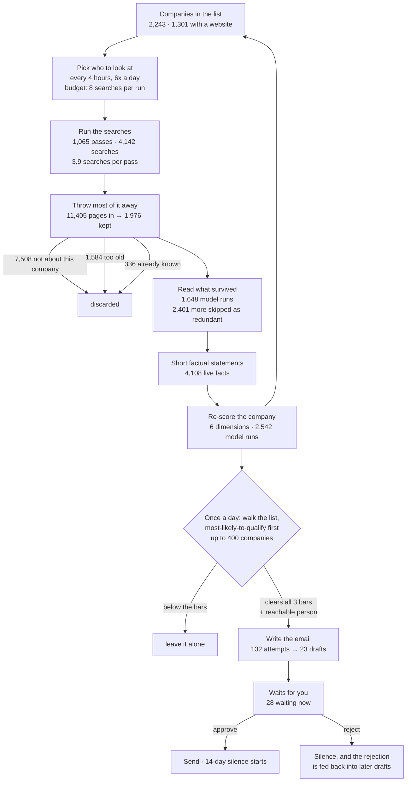
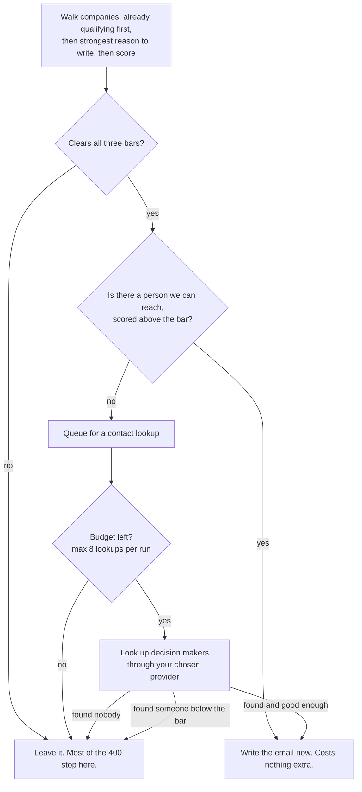

# How it works, end to end

Written 2026-08-16. Every number is measured on the Sudden workspace over the 30 days ending that
day: 2,243 companies, 117,858 stored facts. Reproduce commands are at the bottom.

No code names in the headings. Where a stage maps to a file, the file is named at the end of the
section.

---

## The one-paragraph version

A list of companies goes in. Six times a day the system picks a handful of them, runs about four web
searches on each, throws away roughly five of every six pages it gets back, reads the survivors with
a cheap model to pull out short factual statements, re-scores the company on six dimensions, and
files everything. Once a day it walks the list, most-likely-to-qualify first, finds companies that clear three score
bars and have a reachable person, and writes them an email. The email waits for you to approve it.
Approving sends it and starts a two-week silence on that company. All of it cost between $34 and $49
last month.

---

## The map



---

## Stage 1. Deciding who to look at

Nothing looks at all 2,243 companies. Every four hours, six times a day, the system sorts the list
into three speeds based on the company's current score.

| speed | who lands here | how often it gets looked at |
|---|---|---|
| Fast | score of 0.5 or better, **or** a strong recent event, **or** they replied to you | every 96 hours |
| Normal | score between 0.3 and 0.5 | every 7 days |
| Slow | score under 0.3 | every 30 days |
| Off | you rejected a draft for them recently | never, until the block expires |

Two things override the score. A company you are mid-conversation with is always fast. A company
where the last few looks found nothing usable gets stretched to two or three times its normal gap,
so money follows results rather than a score on paper.

**A company with no website is never looked at, at any speed.** No website means no company blog to
read and nobody to find an email for, so a search there is money with no possible payoff. That is
942 of the 2,243, or 42% of the list. A separate daily job resolves 50 websites a day from company
names, and once one lands the company rejoins normally.

Among everything due, the search budget is split three ways so it does not only ever re-read the
companies it already knows about:

- 55% on the best-scoring companies, searched deeply
- 30% on companies you are actively talking to, kept current
- 15% on companies never looked at before, one cheap search each

That last slice is what lets an unknown company find its way up. One good find raises its score and
it graduates into the first bucket next cycle.

**The whole bill is set here.** 8 searches per run times 6 runs a day is a ceiling of 48 searches a
day. That ceiling is the same whether the list holds 2,000 companies or 20,000. Growing the list does
not raise the bill; it just means each company waits longer for its turn. Right now the gap between
looks is **74 days**.

*Code: `inngest/functions/entity_research_dispatcher.ts`*

---

## Stage 2. Running the searches

Each company gets its turn as a set of search angles rather than one search on the company name. The
angles are written once per workspace by a model reading your own description of what you sell, and
they are things like the company's own blog, recent news about them, and who their customers are.

Last month: **1,065 turns, 4,142 searches, about 3.9 searches per turn.** 534 different companies got
at least one turn, so the average company that got looked at got looked at twice.

Every result is tagged with which angle found it. That is how you can later tell which kinds of
searching are earning their money and which are not.

*Code: `inngest/functions/research.ts`, `packages/tools/src/exa_search.ts`*

---

## Stage 3. Throwing most of it away

This is the stage that does the most work and it is the one nobody expects. Of 11,405 pages that came
back, **9,429 were discarded and 1,976 were kept. That is 83% thrown out.**

| filter | what it catches | pages dropped |
|---|---|---|
| Is this actually the right company | a different company with the same name, a page that never mentions them | 7,508 |
| Is this current | anything older than the freshness floor, which defaults to 30 days | 1,584 |
| Have we already got this | the exact same page seen before | 1 |
| Is this the same story again | a different URL telling the story we already stored, caught by comparing meaning not text | 336 |

The freshness check exists because search engines report the date they crawled a page when they
cannot find a real publish date, which made 2021 launch posts look like today's news. The date on
every page is now re-checked against the URL and the page's own dateline before anything trusts it.

**This filtering is why the drafts are good. It is not why the bill is small.** The pages were already
paid for at search time. What the filtering saves is the cost of reading them, and reading is 14% of
the bill against searching at 86%.

*Code: `inngest/functions/research.ts`, `packages/tools/src/published_date.ts`*

---

## Stage 4. Reading what survived

Each surviving page goes to a cheap model that pulls out short factual statements. Not a summary. A
list of separate claims, each tied to the page it came from and the date that page was published.

Before spending a model call, three checks throw the run away:

| skip | why | times last month |
|---|---|---|
| We just read this company | several pages for one company arriving at once get batched into one read | 2,130 |
| We read this company very recently | a per-company waiting period | 250 |
| Identical page text | the same body arriving twice | 21 |

**1,648 reads ran. 2,401 were skipped. A naive one-read-per-page approach would have run 4,049, so
this ran 41% of that.** End to end, one model read happens per 6.9 pages originally fetched.

Each read costs about $0.0029. The model is the cheap tier, and 79% of the words sent to it are
served from cache because the instructions do not change between runs.

The list now holds **4,108 live facts** across the companies that have been looked at.

*Code: `inngest/functions/agent_logic.ts`*

---

## Stage 5. Scoring the company

Every new fact re-scores its company on six things. Three are calculated with arithmetic and no model
at all. Three need a model to judge.

| dimension | how it is decided | weight |
|---|---|---|
| Industry match | model judges it against your description | 30% |
| Stage match | model judges company size and maturity | 20% |
| How much we actually know | counted from the facts on file | 20% |
| Strength of the event | model judges how strong the reason to reach out is | 10% |
| How recent | calculated from source dates, halving as things age | 10% |
| Nearby companies | averaged from scored companies connected to this one | 10% |

If a dimension cannot be measured for a company, it is dropped from the average and the other weights
are stretched to fill the gap. It is not scored zero. Scoring an unmeasurable thing zero used to
crush every company into the same band, because 92% of this list has no connections to average and
the model returned the same "unknown" value for stage on every single company.

**2,542 scoring model runs last month, writing 9,904 score rows.** Each run costs about $0.0008, and
95% of its words come from cache.

*Code: `packages/tools/src/scoring.ts`*

---

## Stage 6. The daily walk

Everything above is triggered by new information arriving. That leaves a hole: a company that scored
well once and then went quiet is never revisited, so it never gets written to.

So once a day the system walks up to 400 companies and does this. The order is not the overall score:
it leads with the companies that already clear all three bars, then the ones with the strongest reason
to write, and only then falls back to score. The walk does nothing at all for a company that misses
the bars, so spending its 400 slots on companies with no reason to write is the one mistake it cannot
afford. Ordering by score alone reached 51 of the 67 companies that qualified.



The three bars, all of which must clear:

- Overall score of **0.65 or better**
- Strength of the event **0.7 or better**
- How much we know **0.5 or better**

All three exist to stop one specific thing: emailing a company just because it appeared in a
directory. A directory mention scores about 0.3 on event strength and never gets through.

The run is capped at 8 contact lookups and 12 email attempts so a single night cannot drain a
provider balance.

If any provider comes back saying out of money, wrong key, or slow down, **the whole pass stops**,
writes a plain sentence onto the workspace explaining why, and waits. It does not keep firing at an
empty balance. A button clears it and the next run picks up where it left off.

*Code: `inngest/functions/advance_accounts.ts`, `packages/tools/src/action_selector.ts`*

---

## Stage 7. Writing the email

Two model calls, not one.

The first call picks the argument. It reads the company's facts, looks at the list of problems you
sell against, and picks which one this company actually has, naming the fact that proves it. This
call exists because of a measured failure: when finished example emails sat in the model's context,
it copied their questions almost word for word, transposing them onto unrelated industries. Three
separate written instructions not to copy did not stop it. Picking the argument first and then hiding
the example bodies did.

It can come back with no answer, and the reason is recorded rather than discarded. Nothing configured
to choose between. No facts to read. None of your problems reach this company. Found a problem but
cannot point at a fact showing it. Every fact is about a part of the business you said you cannot
serve.

The second call writes the email against a structure, not an example. It leads with news only if the
news is inside **14 days**, and will use an older fact as supporting evidence up to **90 days**. This
call uses the better, more expensive model tier, because it is the only output a human reads. It
costs about $0.0067, roughly eight times a fact-reading run.

The drafter checks its own work and refuses to produce anything when the hook is weak or the
recipient is wrong, which is why **132 attempts produced 23 drafts.**

Finished text is stripped of em dashes and any phrase on your banned list before anyone sees it.

*Code: `packages/tools/src/pick_angle.ts`, `packages/tools/src/prompt_builders.ts`,
`inngest/functions/agent_logic.ts`*

---

## Stage 8. The approval

Every draft becomes one thing waiting for you. **28 are waiting right now.** Approve, reject, or edit
and approve.

On approve, for email: the message is sent first and only then is the approval recorded. If the send
fails, the approval stays open so you can retry rather than losing the draft into a "sent" state that
never sent. For LinkedIn, nothing sends. The text is handed to you to paste, because there is no
sanctioned way to send LinkedIn messages by machine.

Your edits are stored either way, including for LinkedIn where nothing was sent.

---

## Stage 9. What happens after

**Approved and sent.** The company is marked with the send time and goes silent for **14 days**. No
re-drafting during that window, checked before anything else.

**Rejected.** The rejection is stored against the company, and a rejection puts the company out of
reach of the daily walk for the same period.

**Edited then approved.** This is the one that compounds. The difference between what was written and
what you sent is kept, and later drafts are shown your corrections from the last **90 days** as
examples of what to do differently. Rewriting a draft teaches it. Rejecting it only stops it.

**The score keeps moving regardless.** New facts keep arriving on their own cadence, and the company
can climb into or fall out of the fast lane on its own.

---

## The whole funnel, in numbers

30 days on Sudden:

| stage | count | what it cost |
|---|---|---|
| Companies in the list | 2,243 | |
| Companies with a website | 1,301 (58%) | |
| Companies actually looked at | 534 (41% of those eligible) | |
| Search turns | 1,065 | |
| Web searches | 4,142 | $29 to $41 |
| Pages returned | 11,405 | |
| Pages kept after filtering | 1,976 (17%) | |
| Model reads run | 1,648 | $4.70 |
| Model reads skipped as redundant | 2,401 | $0 |
| Live facts on the list | 4,108 | |
| Scoring runs | 2,542 | $2.08 |
| Email attempts | 132 | $0.89 |
| **Drafts produced** | **23** | |
| Waiting for approval | 28 | |
| **Total** | | **$34 to $49** |

Per-unit:

- **$0.022 per company per month** to keep it watched, scored and current
- **$0.046 per search turn**, all in
- **$0.092 per company actually looked at**

The two price tables in the repo disagree on the model bill ($4.83 against $7.66) and the search
provider's real billed number across the whole account was $40.82, which is why everything here is a
band rather than a single figure.

---

## Where it stalls

Five honest problems, in order of how much they cost.

**The drafter refuses because of who we found, not what we know.** Over 30 days the drafter wrote 91
refusals on companies that had already cleared every bar. 74 of them, 81%, are about the recipient:
the person we found does not match any message template we have. 17 are about missing facts. The
refusals are filed under a label that says `facts_insufficient_for_draft`, which is why this looked
for months like a research problem.

The mechanism is a mismatch nothing checks. Three message templates are in use, aimed at founders and
CEOs, at engineering or infrastructure leaders who own video delivery, and at analysts and media. Of
the 254 contacts bought so far, 26% are founders or CEOs, 7% are technical owners, 2% are media, and
**66% match none of the three** — Head of Content, Director of Operations, Director of Programming,
Head of Product, Regional Director. Real senior operators at streaming companies, and there is no
template to write to any of them, so the drafter refuses.

Underneath that, the contact scorer and the drafter disagree about what a good contact is. The scorer
ranks contacts by seniority, because `policy.personas.target_roles` is empty and the code falls back
to seniority when it is. The drafter needs a template audience match. So the system pays to find a
contact, scores a Head of Content highly, hands it over, and the drafter says wrong job title. That
is 66 of the 91 refusals, and the walk separately gave up on 176 companies where it found nobody at
all.

This is the biggest loss in the system and it sits at the very end, after every dollar has been
spent. Closing it needs one more template and a persona list, both workspace config.

**Almost nothing gets used.** 2,421 facts were bought and 17 were quoted in an email. That is 0.7%.
Every fact costs about $0.01 to produce; every fact that reaches a message costs about $2. This is a
cost story rather than a volume one: citing more facts per message makes the messages richer, not more
numerous.

**23 drafts is not a sales motion.** 400 companies get scanned and most stop at the three bars. The
bars are correct in intent. The score feeding them turned out not to be the problem, and the ordering
in front of them was: see the section below.

**Half the list holds the identical score, and that is the right answer.** 1,060 of the 2,133 scored
companies score exactly 0.84. They are CSV rows carrying the same five columns (what it is, country,
product, description, business model) that have never been researched, so every input behind the
score reads the same for all of them. No formula can rank companies whose evidence is identical, and
the two alternatives tested made it worse: crediting the unmeasured part of the score at a neutral
midpoint pushed 72% into a single band, and refusing to score "is something happening" for a company
nobody has looked at closed the gap between researched and unresearched companies from 0.085 to
0.008. The score is honest. The fix is research, not arithmetic.

What this did break was the daily walk, which sorted by that score. It scans the best 400 and acts
only on companies clearing all three bars, and it was ranking on the one number that is tied across
half the list and barely moves with the bars it gates on. 67 companies cleared all three; the walk
reached 51 and never saw the other 16, the same 16 every day, because a tie sorts the same way every
time. It now orders by what it gates on — companies that clear the bars first, then the strength of
the reason to write, then fit — and reaches 67 of 67. That is 31% more companies to write to at no
extra cost, and it is the change to make before touching the rubric or the weights.

*Code: `inngest/functions/advance_accounts.ts` (`compareWalkOrder`), asserted in
`scripts/check_advance_order.ts`.*

**Coverage gets worse as the list grows and the bill does not move.** At 1,301 eligible companies the
gap between looks is 74 days. At 5,000 it is 282 days, and the share of the list with news fresh
enough to lead an email with falls from 19% to 5%. A bigger list at the same budget is a worse
product, not a more expensive one.

---

## Every knob, and where it lives

All of these are workspace settings. None needs a code change.

| knob | default | what it does |
|---|---|---|
| searches per run | 8 | the entire bill |
| how often the picker runs | every 4 hours | 6 times a day |
| speed for each score band | 96h / 7d / 30d | how often a company comes up |
| budget split | 55 / 30 / 15 | best companies / active conversations / never-seen |
| freshness floor | 30 days | how old a page can be and still count |
| websites resolved per day | 50 | how fast the 942 without one rejoin |
| the three bars | 0.65 / 0.7 / 0.5 | who is worth writing to |
| scoring weights | 30/20/20/10/10/10 | what "good fit" means to you |
| news window | 14 days | how fresh news must be to lead with it |
| supporting evidence window | 90 days | how old a fact can be and still be used |
| silence after send | 14 days | how long before the same company can be written to again |
| contact lookups per run | 8 | provider spend per night |
| email attempts per run | 12 | model spend per night |
| companies scanned per run | 400 | how deep the daily walk goes |
| which model does what | cheap for reading and scoring, better for writing | paste any model id |
| where data comes from | any HTTP endpoint | URL, headers, and where the list sits in the response |

---

## Reproduce

```
pnpm exec tsx scripts/_cost_01_unit_economics.ts
pnpm exec tsx scripts/_cost_03_funnel.ts
pnpm exec tsx scripts/_cost_05_scaling.ts
DOTENV_CONFIG_PATH=.env.local pnpm exec tsx scripts/_cost_02_exa_actual.ts --days 30
DOTENV_CONFIG_PATH=.env.local WS=e7052848-2270-41ac-90b6-d9b75c87f6d3 DAYS=30 pnpm exec tsx benchmark/v1/system_yield_audit.ts
DOTENV_CONFIG_PATH=.env.local WS=e7052848-2270-41ac-90b6-d9b75c87f6d3 DAYS=30 pnpm exec tsx benchmark/v1/enrichment_cost_audit.ts
DOTENV_CONFIG_PATH=.env.local pnpm exec tsx scripts/_chk_approvals.ts
```
